# Penggunaan VHDX untuk Standarisasi OS
Langkah-langkah pembuatan dan penggunaan `.vhdx` untuk standarisasi operating sistem pada PC laboratorium.

**Perlu dipahami bahwa spesifikasi yang dicantumkan di sini ditulis berdasarkan environment yang digunakan saat penulis melakukan simulasi.**

### Kebutuhan:
+ PC dengan host Windows 10 Pro atau Enterprise edition
    Untuk membuat image. Spesifikasi yang digunakan pada pembuatan tulisan ini adalah Intel Core i3 dengan RAM 4GB. Mengapa Pro atau Enterprise? Karena fitur Hyper-V yang kita butuhkan hanya dapat diaktifkan pada kedua edisi tersebut.
+ Easy BCD pada setiap PC yang akan diberi virtual disk.

#### Hardware:
Lakukan _setting_ agar IP virtual disk sama dengan IP host. Hal ini dilakukan agar IP virtual disk tidak berubah-ubah. Karena PC di lab biasanya diberi IP statis.

Ada beberapa cara yang dapat dilakukan. Salah satunya adalah dengan mengatur IP PC melalui setting di DHCP server seperti di bawah ini:
1. Lepaskan semua kabel LAN yang terhubung pada PC lab.
2. Atur pool IP untuk PC lab pada DHCP server.
3. Pasang kabel LAN pada salah satu PC (lakukan mulai dari PC dengan IP address awal).
4. Buka setting DHCP server dan set agar IP yang diberikan berdasarkan mac address (sehingga saat virtual disk di-load, ia akan mendapatkan IP yang sama dengan host PC-nya. Karena mac address menempel pada _interface_  (network interface)).
5. Lakukan '_make static_' pada rule yang kita set tadi sehingga IP yang diberikan pada mac address tersebut menjadi statis (tetap sama walaupun PC tersebut _reconnect_).

### Persiapan pembuatan .vhdx:
Langkah-langkah ini dilakukan pada PC tempat anda membuat virtual disk.
1. Nyalakan fitur Hiper-V di windows.
    A. Klik kanan pada lambang windows (di taskbar) dan klik 'Apps and Features'.

    

    B. Klik '**Programs and Features**' di bawah 'related settings'

    

    C. Klik '**Turn Windows Features on or off**'

    

    D. Centang '**Hyper-V**' dan klik '**OK**'
    Sumber: [Microsoft](https://docs.microsoft.com/en-us/virtualization/hyper-v-on-windows/quick-start/enable-hyper-v)
2. Restart PC anda.

### Pembuatan image .vhdx:
1. Membuat virtual switch:
    + Klik **Virtual Switch Manager** yang terletak di sebelah kanan window

    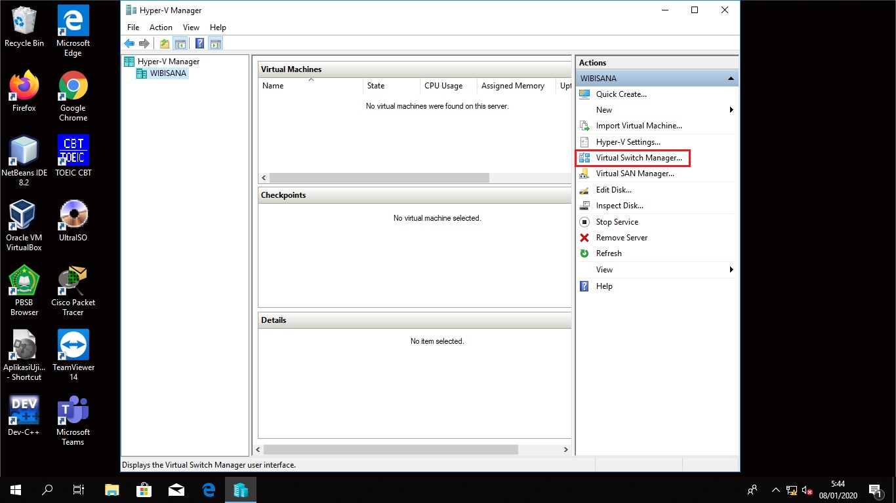

    + Pilih **External** pada tipe virtual switch yang akan dibuat lalu llik **Create Virtual Switch**

    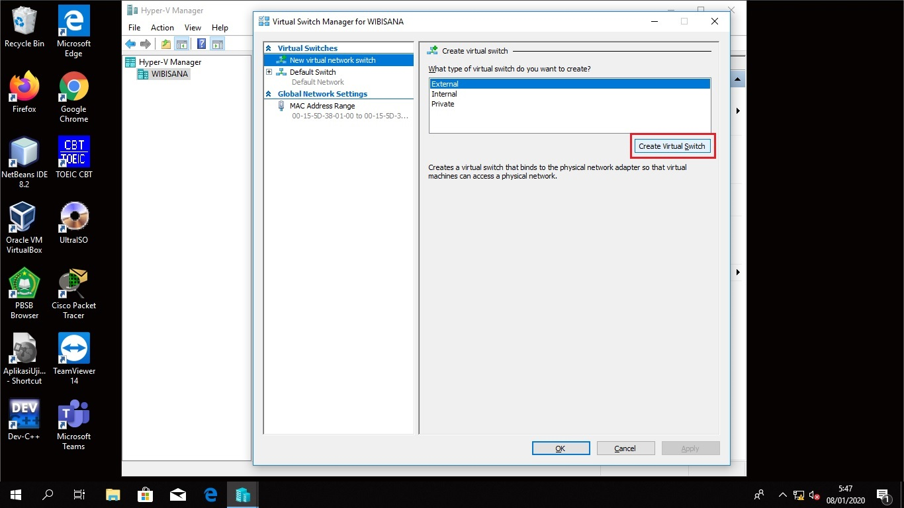

    + Ubah nama virtual switch yang baru anda buat agar mudah mengidentifikasinya.
    + Bila tadi anda memilih tipe virtual switch External maka pada _Connection type_ pilih adapter yang ingin anda gunakan pada dropdown di bawah pilihan _External network_.
    + Bila sudah, klik **Apply** lalu **OK**.

    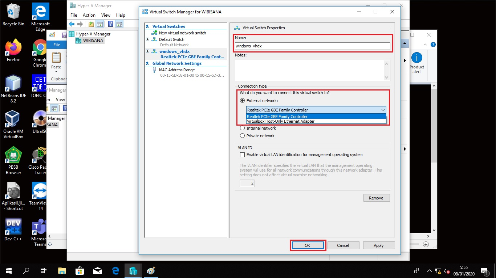

2. Membuat virtual machine
    + Klik **New** lalu **Virtual Machine...** pada kolom _Actions_ yang terletak di sebelah kanan window.

    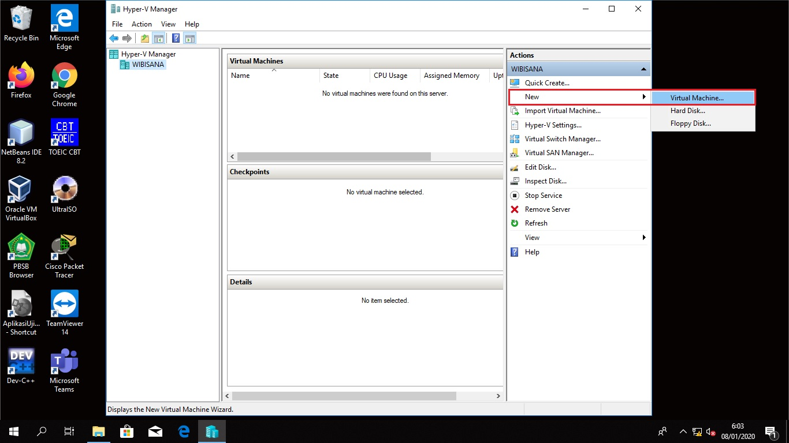

    + Pada bagian "_Before You Begin_" klik **Next**
    
    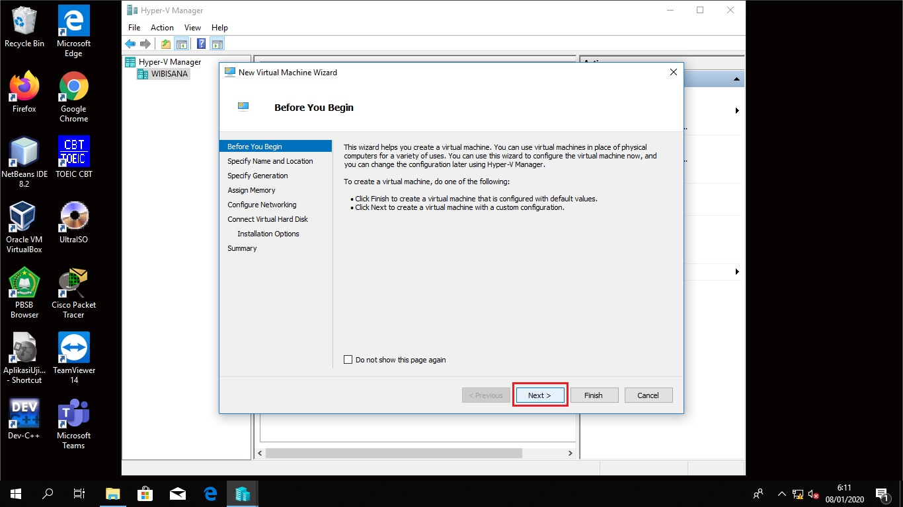

    + Pada bagian "_Specify Name and Location_" isikan nama virtual machine yang anda inginkan pada field "**Name:**".

    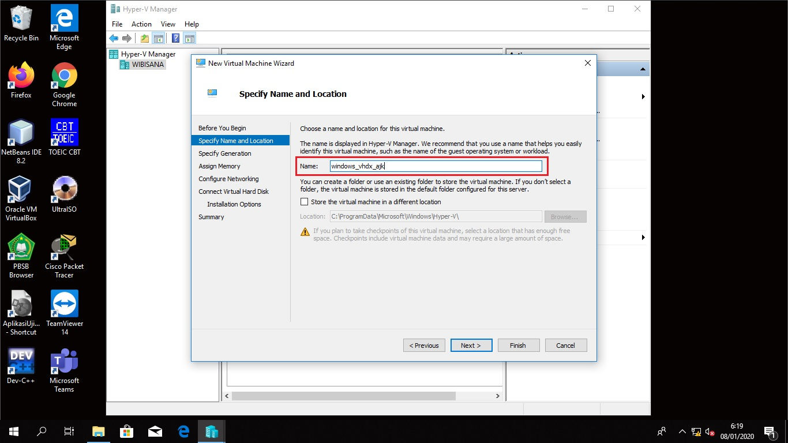

    + Masih pada bagian yang sama, centang "_Store the cirtual machine in a different location_" lalu klik **Browse...** dan buka lokasi yang anda inginkan bila anda ingin menyimpan virtual machine anda di lokasi yang berbeda dari yang tertera di field "**Location:**". 
    
    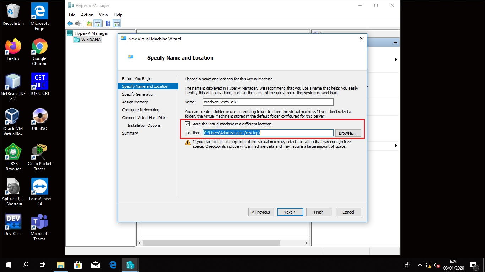
    
    + Bila sudah, klik **Next**
    
    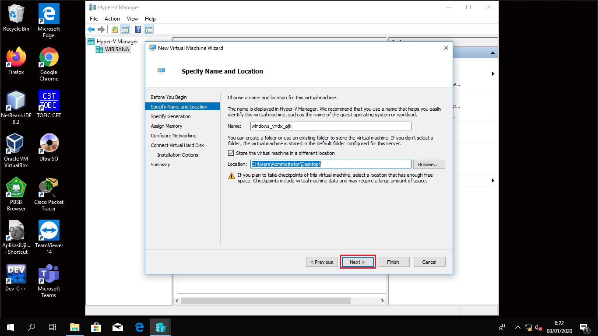

    + Pada bagian "_Specify Generation_" pilih **Generation 1** lalu klik **Next**
    
    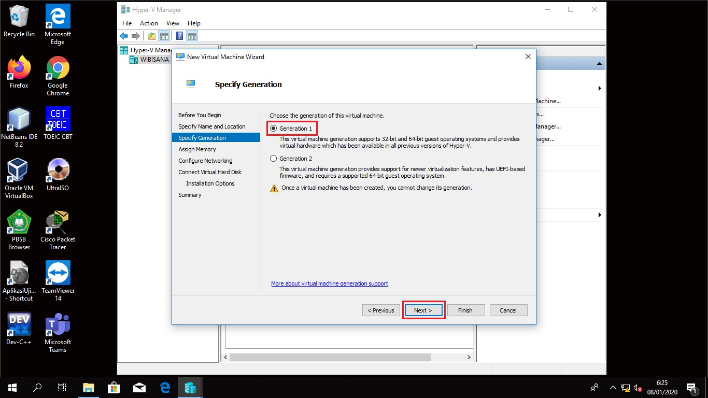

    + Pada bagian "_Assign Memory_" isikan field "**Startup memory**" dengan **1024** MB bila RAM PC yang akan digunakan adalah 4 GB dan boleh memberikan **2048** MB bila RAM-nya 8 GB.
    
    
    
    + Masih di bagian yang sama, centang "_Use Dynamic Memory for this virtual machine._". Bila sudah, klik **Next**
    
    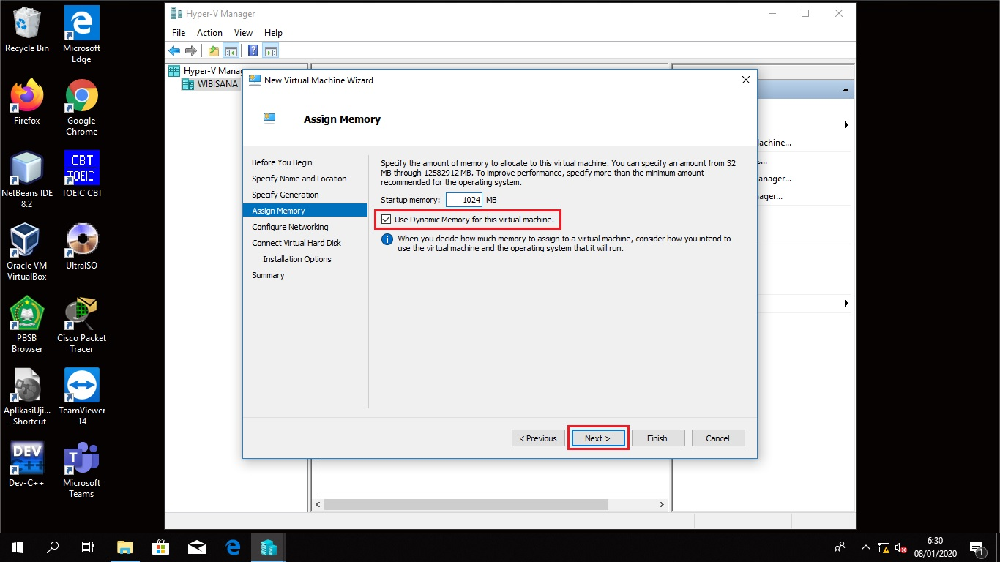

    + Pada bagian "_Configure Networking_" di field "**Connection**", pada dropdown pilih virtual switch yang sudah anda buat tadi lalu **Next**
    
    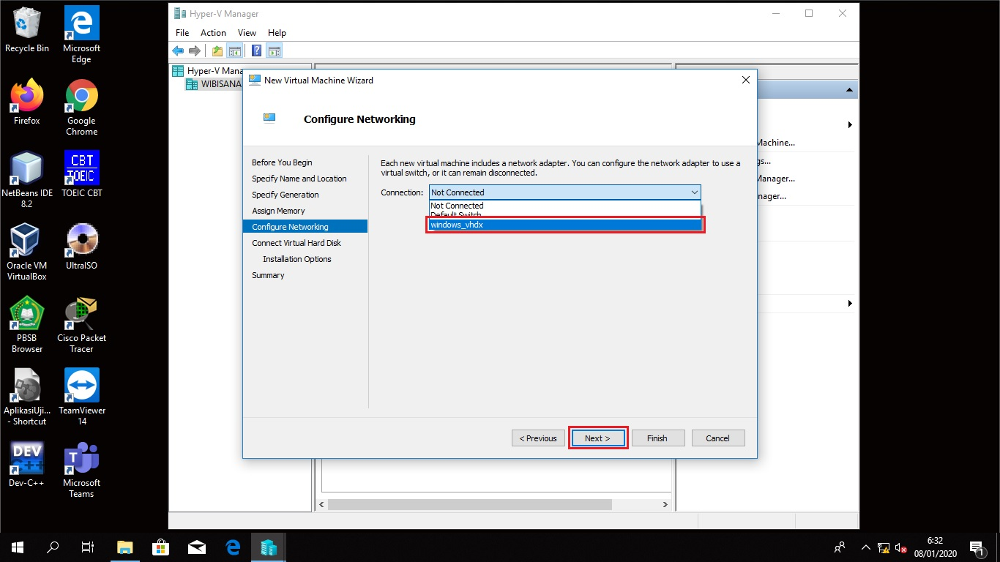
        
    + Pada bagian "_Connect Virtual Hard Disk_" di field "**Size**", isikan sesuai dengan ukuran hard disk yang anda inginkan lalu klik **Next**
    
    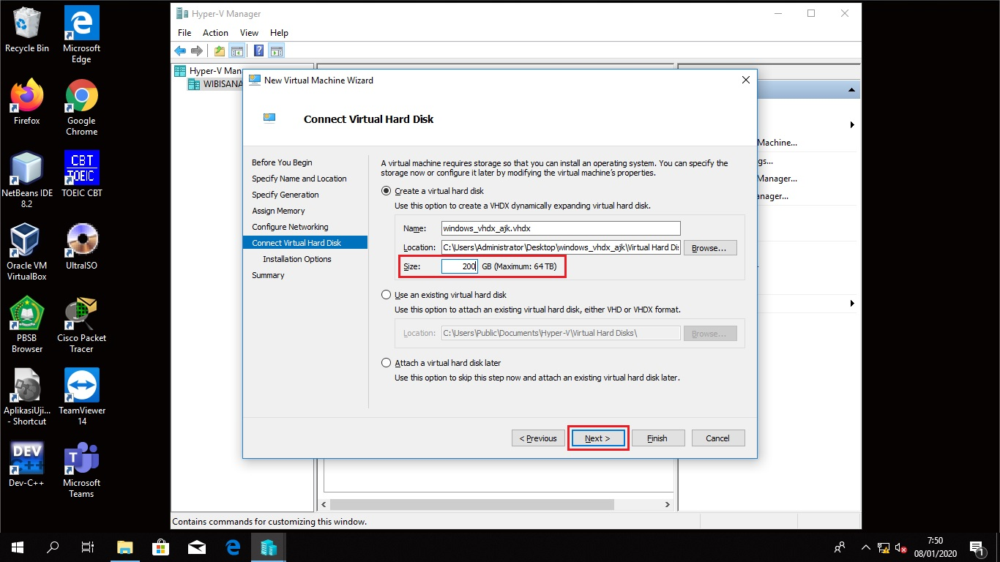
        
    + Pada bagian "_Installation Options_" pilih "**Install an operating ystem from a bootable CD/DVD-ROM**"
    
    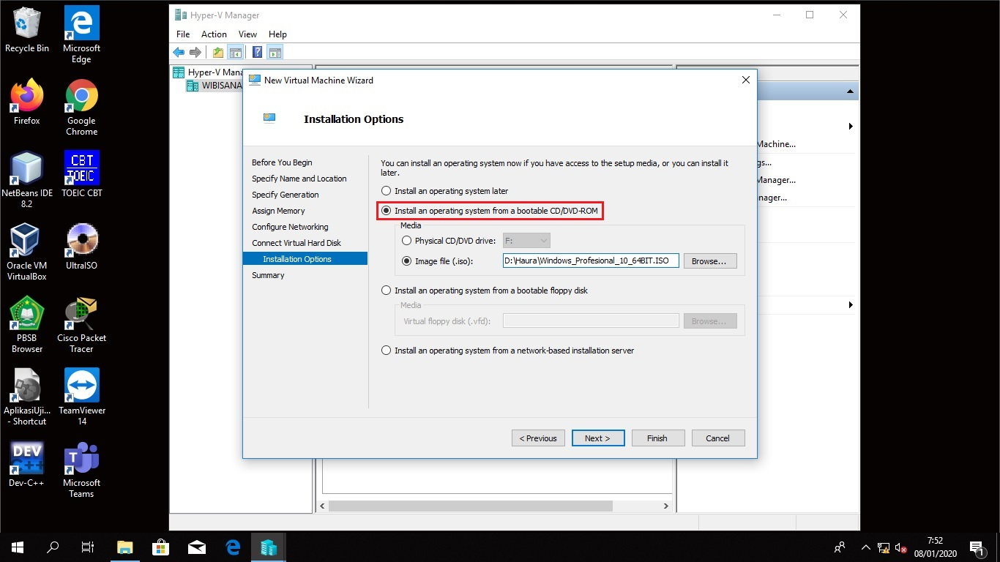
        
    + Masih pada bagian yang sama, pilih "**Image file (.iso):**" lalu Browse ke .iso windows yang sudah dipersiapkan sebelumnya. Lalu klik **Next**
    
    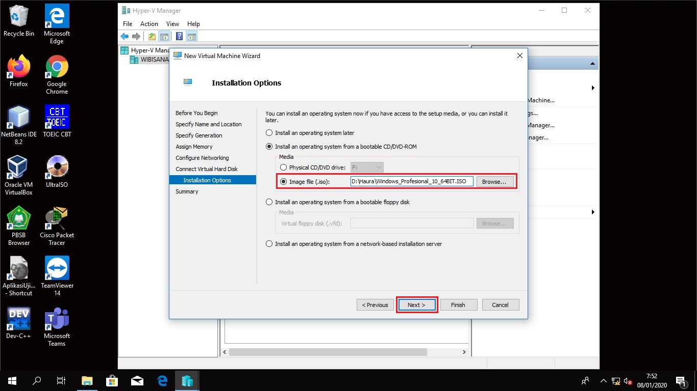
        
    + Pada bagian "Summary" periksa kembali apakah setting anda sudah benar. Bila sudah, klik **Fnish**.
    
    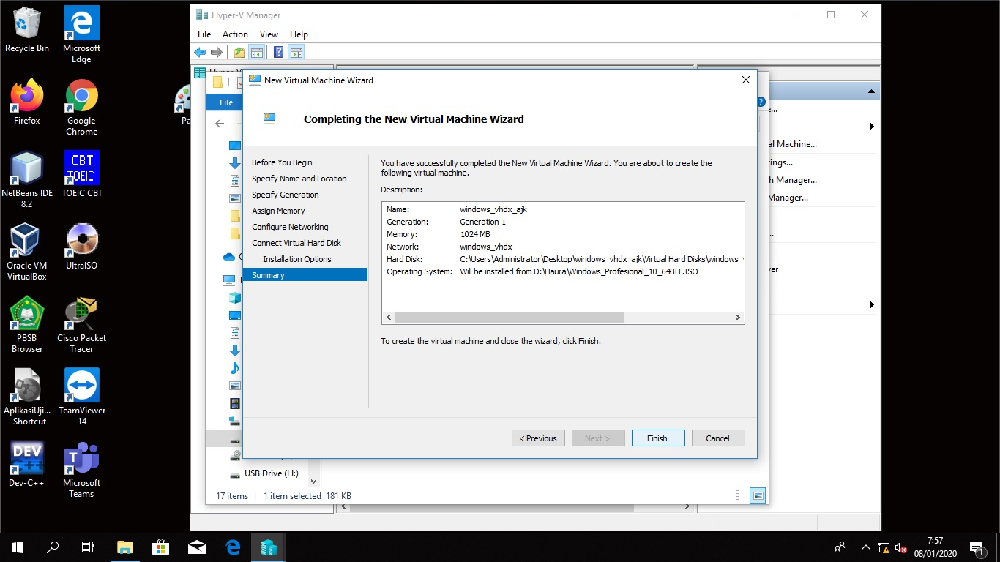

### Mengisi virtual machine yang baru dibuat dengan software sesuai kebutuhan
1. Jalankan virtual machine
2. Install software sesuai kebutuhan
3. Shutdown virtual machine.
4.  Export virtual machine agar menjadi satu file `.vhdx`. Bila masih ada file `.avhdx` maka jalankan lagi virtual machine anda agar dua file tersebut _merged_ menjadi `.vhdx`.
5. _Copy_ file `.vhdx` tadi untuk diberikan pada PC-PC di lab anda.

### Mengatur bootorder dengan Easy BCD
1. Open Easy BCD
    Langkah ini dilakukan agar virtual disk anda dapat di-_load_ pada windows boot loader.
    + Buka Easy BCD
    + Portable/external media lalu lengkapi isiannya.
    + Edit boot menu.
