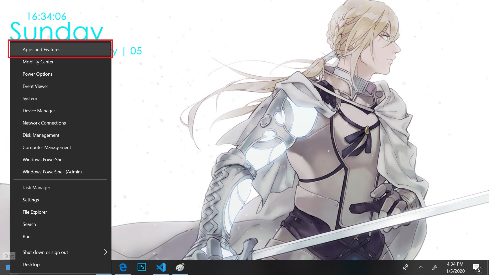
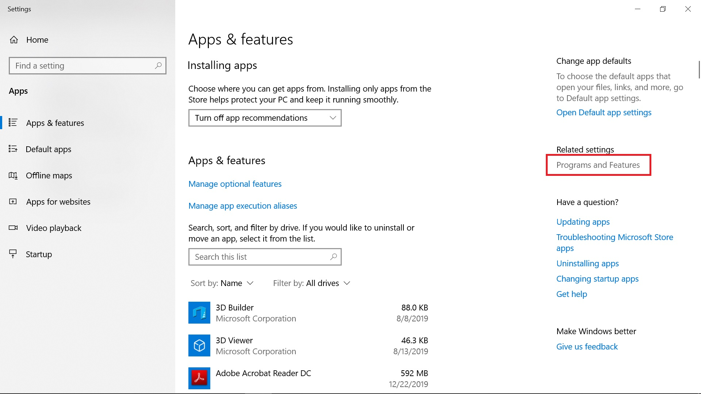
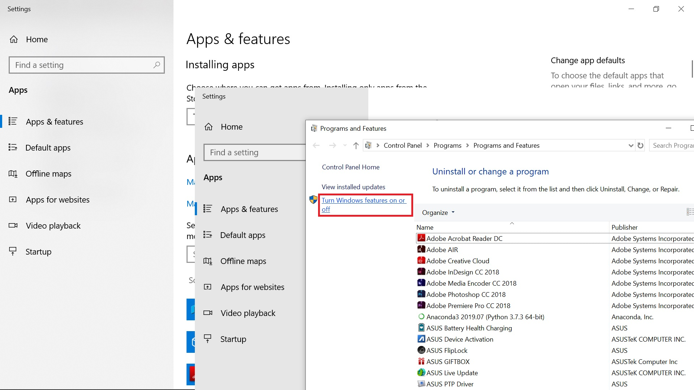

# Penggunaan VHDX untuk Standarisasi OS
Langkah-langkah pembuatan dan penggunaan `.vhdx` untuk standarisasi operating sistem pada PC laboratorium.

**Perlu dipahami bahwa spesifikasi yang dicantumkan di sini ditulis berdasarkan environment yang digunakan saat penulis melakukan simulasi.**

### Kebutuhan:
+ PC dengan host Windows 10 (untuk membuat image. Spesifikasi yang digunakan pada pembuatan tulisan ini adalah Intel Core i3 dengan RAM 4GB)
+ Easy BCD pada setiap PC yang akan diberi virtual disk.

#### Hardware:
Lakukan _setting_ agar IP virtual disk sama dengan IP host. Hal ini dilakukan agar IP virtual disk tidak berubah-ubah. Karena PC di lab biasanya diberi IP statis.

Ada beberapa cara yang dapat dilakukan. Salah satunya adalah dengan mengatur IP PC melalui setting di DHCP server seperti di bawah ini:
1. Lepaskan semua kabel LAN yang terhubung pada PC lab.
2. Atur pool IP untuk PC lab pada DHCP server.
3. Pasang kabel LAN pada salah satu PC (lakukan mulai dari PC dengan IP address awal).
4. Buka setting DHCP server dan set agar IP yang diberikan berdasarkan mac address (sehingga saat virtual disk di-load, ia akan mendapatkan IP yang sama dengan host PC-nya. Karena mac address menempel pada _interface_  (network interface)).
5. Lakukan '_make static_' pada rule yang kita set tadi sehingga IP yang diberikan pada mac address tersebut menjadi statis (tetap sama walaupun PC tersebut _reconnect_).

### Pembuatan .vhdx:
Langkah-langkah ini dilakukan pada PC tempat anda membuat virtual disk.
1. Nyalakan fitur Hiper-V di windows.
    A. Klik kanan pada lambang windows (di taskbar) dan klik 'Apps and Features'.

    

    B. Klik '**Programs and Features**' di bawah 'related settings'

    

    C. Klik '**Turn Windows Features on or off**'

    

    D. Centang '**Hyper-V**' dan klik '**OK**'
    Sumber: [Microsoft](https://docs.microsoft.com/en-us/virtualization/hyper-v-on-windows/quick-start/enable-hyper-v)
2. Restart PC anda.
3. Buat image (`.vhdx`) dengan langkah-langkah berikut:
    A. Atur virtual switch manager dan hal-hal lain sesuai kebutuhan.
    
    B. Create. Connect. Install.
    
    C. Activate windows pada virtual machine dan install software-software yang dibutuhkan sebagai standar laboratorium anda.
    
    D. Shutdown virtual machine.
    
    E. Export virtual machine agar menjadi satu file `.vhdx`. Bila masih ada file `.avhdx` maka jalankan lagi virtual machine anda agar dua file tersebut _merged_ menjadi `.vhdx`.
    
    F. _Copy_ file `.vhdx` tadi untuk diberikan pada PC-PC di lab anda.
3. Open Easy BCD
    Langkah ini dilakukan agar virtual disk anda dapat di-_load_ pada windows boot loader.
    A. Buka Easy BCD
    
    B. Portable/external media lalu lengkapi isiannya.
    
    C. Edit boot menu.
